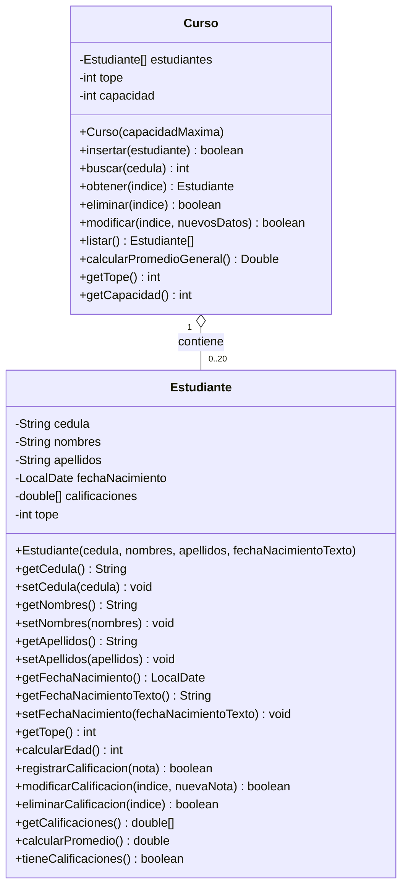

# TDA Estudiante

## Descripcion

Implementación de una aplicación de consola para la gestión de los datos de los estudiantes matriculados en un curso con cupo para hasta **20 estudiantes**, desarrollada en **Java** y **C++**.

### Requerimientos Funcionales y Modelo de Dominio

1. **Clase `Estudiante`:**
   - **Atributos:** Cédula de identidad, nombres, apellidos, fecha de nacimiento y un vector con las notas (máximo de **7 notas**, asumiendo la cantidad máxima de actividades evaluativas).
   - **Constructor:** Inicialización de atributos y estructuras.
   - **Métodos:** Cálculo de edad a partir de la fecha de nacimiento, registro, modificación, eliminación de notas y cálculo del promedio individual.

2. **Clase / TDA `Curso`:**
   - Administra la colección de hasta 20 estudiantes almacenados en un arreglo/vector.
   - Implementa el método `buscar(cedula)` para localizar a un estudiante por su cédula de identidad, además de operaciones para insertar, eliminar, listar y calcular el promedio general.

3. **Menú de Opciones (`GESTOR DE PERSONAS`):**
   ```text
   === GESTOR DE PERSONAS ===
   1 Estudiantes.
   2 Registro de calificaciones.
   3 Determinar el promedio de notas de un estudiante.
   4 Determinar el promedio de notas del curso.
   Teclee su opción (1-4)
   ```

### Comportamiento del Sistema por Opción

- **Opción 1: Estudiantes**
  - Muestra un listado con un **autonumérico** para identificar cada registro y los datos de cada estudiante previamente registrado.
  - Ofrece un submenú que permite **ingresar**, **modificar** y **eliminar** los datos de un estudiante.
  - Para las opciones de modificar y eliminar, el usuario indicará el valor del autonumérico que identifica al registro.
  - Cada vez que se inserte, modifique o elimine un registro (cuando corresponda), se preguntará al usuario si desea realizar la misma acción una vez más.
  - **Validaciones:**
    - Si ya se registraron los 20 estudiantes (cupo máximo), no se permitirá insertar nuevos registros.
    - Si no hay estudiantes registrados, no se permitirá intentar eliminar registros.

- **Opción 2: Registro de calificaciones**
  - Solicita el número de cédula del estudiante:
    - **Si el estudiante está registrado:** Muestra sus datos personales (nombres, apellidos y edad) junto con el listado de calificaciones previamente registradas. Permite insertar nuevas calificaciones (tantas como el usuario desee hasta el tope de 7), así como modificar o eliminar calificaciones existentes mediante su índice.
    - Si se alcanza el límite máximo de 7 notas, el sistema notificará que se han ingresado todas las calificaciones posibles y dará por terminado el proceso.
    - **Si el estudiante no existe:** Notifica oportunamente al usuario y le da la opción de ingresar otro número de cédula o regresar al menú principal.

- **Opción 3: Determinar el promedio de notas de un estudiante**
  - Solicita el número de cédula del estudiante:
    - **Si se encuentra registrado:** Muestra sus datos (nombres, apellidos, edad y promedio de calificaciones).
    - **Si no se encuentra:** Emite un mensaje de error indicando que no se encontró un estudiante con el número de cédula indicado.

- **Opción 4: Determinar el promedio de notas del curso**
  - Muestra el promedio general de calificaciones de todos los estudiantes del curso.
  - Si ningún estudiante tiene calificaciones registradas, muestra el mensaje: *"No se han registrado calificaciones de estudiantes"*.

> **Nota:** Tanto el conjunto de estudiantes en el curso como el conjunto de notas por estudiante se almacenan y administran mediante vectores/arreglos.

## Estructura del proyecto
Arquitectura modular en 3 paquetes/carpetas (implementada en Java y C++):
- `modelo/`  -> Clase del dominio (`Estudiante`) con datos personales y calificaciones.
- `negocio/` -> TDA `Curso` que administra la coleccion de estudiantes.
- `app/`     -> Punto de entrada (`Main.java` / `main.cpp`) del programa.

## Diagrama de clases



Detalle y documentación adicional en: [diagramas/diagrama-clases.md](diagramas/diagrama-clases.md)

## Como ejecutar

### Java
Desde la carpeta `Java`:
```bash
# Compilar todas las clases
javac -d bin src/modelo/*.java src/negocio/*.java src/app/*.java

# Ejecutar
java -cp bin app.Main
```

### C++
> **Nota:** Este proyecto no utiliza archivos de cabecera `.h`. Cada clase contiene su declaracion e implementacion en su archivo `.cpp` con guardas `#ifndef`, incluyendose automaticamente en cadena. Por lo tanto, solo debe compilarse `app/main.cpp`.

Desde la carpeta `CPP`:
```bash
# Compilar
g++ -std=c++17 app/main.cpp -o programa

# Ejecutar (Linux / macOS)
./programa

# Ejecutar (Windows)
programa.exe
```

## Equipo
| Rol | Integrante |
|---|---|
| Lider | Juan Chico |
| Documentacion - Diagramas | Jeremy Torosina |
| Documentacion - Informe | Jullisa Altamirano |
| Backend - Modelo | Joseph Romo |
| Backend - Negocio | Andres Yamuca |
| Frontend - Integracion | Noemi Tuza |
