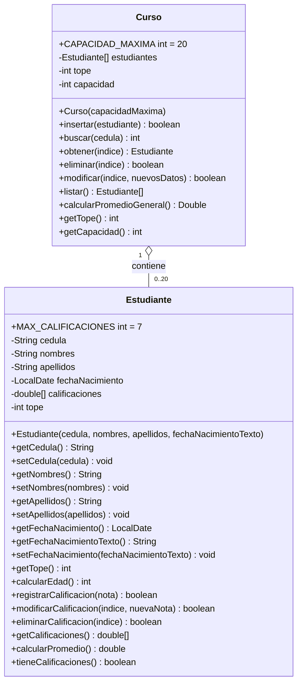

# Diagrama de Clases - TDA Estudiante

```mermaid
classDiagram
    class Estudiante {
        +MAX_CALIFICACIONES int = 7
        -String cedula
        -String nombres
        -String apellidos
        -LocalDate fechaNacimiento
        -double[] calificaciones
        -int tope
        +Estudiante(cedula, nombres, apellidos, fechaNacimientoTexto)
        +getCedula() String
        +setCedula(cedula) void
        +getNombres() String
        +setNombres(nombres) void
        +getApellidos() String
        +setApellidos(apellidos) void
        +getFechaNacimiento() LocalDate
        +getFechaNacimientoTexto() String
        +setFechaNacimiento(fechaNacimientoTexto) void
        +getTope() int
        +calcularEdad() int
        +registrarCalificacion(nota) boolean
        +modificarCalificacion(indice, nuevaNota) boolean
        +eliminarCalificacion(indice) boolean
        +getCalificaciones() double[]
        +calcularPromedio() double
        +tieneCalificaciones() boolean
    }

    class Curso {
        +CAPACIDAD_MAXIMA int = 20
        -Estudiante[] estudiantes
        -int tope
        -int capacidad
        +Curso(capacidadMaxima)
        +insertar(estudiante) boolean
        +buscar(cedula) int
        +obtener(indice) Estudiante
        +eliminar(indice) boolean
        +modificar(indice, nuevosDatos) boolean
        +listar() Estudiante[]
        +calcularPromedioGeneral() Double
        +getTope() int
        +getCapacidad() int
    }

    Curso "1" o-- "0..20" Estudiante : contiene
```
