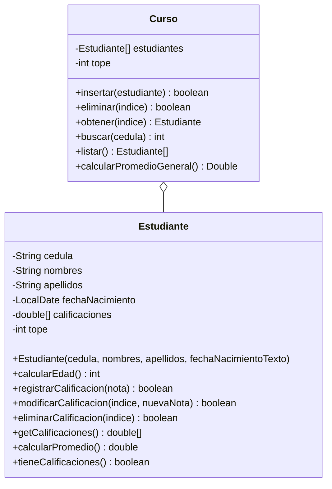

```mermaid
classDiagram
    class Estudiante {
        -String cedula
        -String nombres
        -String apellidos
        -LocalDate fechaNacimiento
        -double[] calificaciones
        -int tope
        +Estudiante(cedula, nombres, apellidos, fechaNacimientoTexto)
        +calcularEdad() int
        +registrarCalificacion(nota) boolean
        +modificarCalificacion(indice, nuevaNota) boolean
        +eliminarCalificacion(indice) boolean
        +getCalificaciones() double[]
        +calcularPromedio() double
        +tieneCalificaciones() boolean
    }
    class Curso {
        -Estudiante[] estudiantes
        -int tope
        +insertar(estudiante) boolean
        +eliminar(indice) boolean
        +obtener(indice) Estudiante
        +buscar(cedula) int
        +listar() Estudiante[]
        +calcularPromedioGeneral() Double
    }
    Curso o-- Estudiante
```
